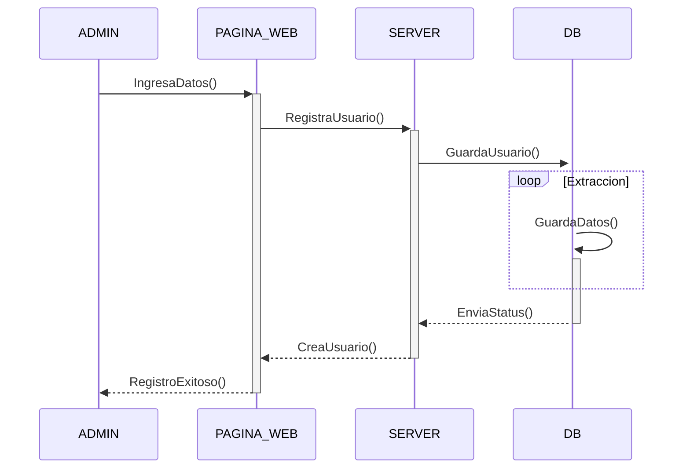
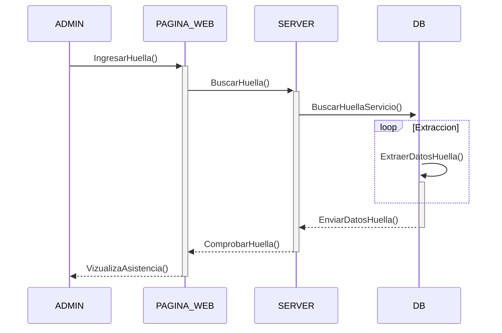
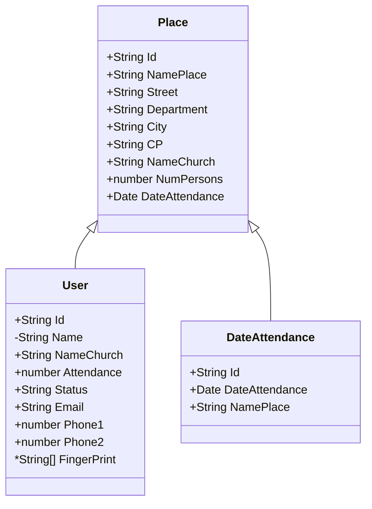
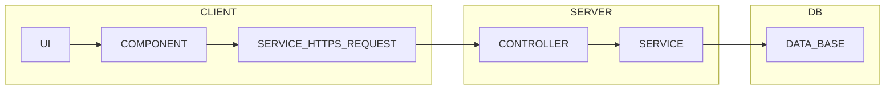

# Asistenciapp

##
# SEQUENCE DIAGRAM

## Admin Register

```mermaid
sequenceDiagram
ADMIN->>+PAGINA_WEB: IngresaDatos()
PAGINA_WEB->>+SERVER: RegistraUsuario()
SERVER->>+DB: GuardaUsuario()
loop Extraccion
  DB->>+DB: GuardaDatos()
end
DB-->>-SERVER:EnviaStatus()
SERVER-->>-PAGINA_WEB: CreaUsuario()
PAGINA_WEB-->>-ADMIN:RegistroExitoso()
```
## Admin Attendance

```mermaid
sequenceDiagram
ADMIN->>+PAGINA_WEB: VizualizaDatos()
PAGINA_WEB->>+SERVER: MostrarUsuario()
SERVER->>+DB: UtilizarServicio()
loop Extraccion
  DB->>+DB: ExtraerDatos()
end
DB-->>-SERVER:EnviarDatos()
SERVER-->>-PAGINA_WEB:UtilizarDatos()
PAGINA_WEB-->>-ADMIN:VizualizaUsuario()
```
##
## User Attendance

```mermaid
sequenceDiagram
ADMIN->>+PAGINA_WEB: IngresarHuella()
PAGINA_WEB->>+SERVER: BuscarHuella()
SERVER->>+DB: BuscarHuellaServicio()
loop Extraccion
  DB->>+DB: ExtraerDatosHuella()
end
DB-->>-SERVER:EnviarDatosHuella()
SERVER-->>-PAGINA_WEB:ComprobarHuella()
PAGINA_WEB-->>-ADMIN:VizualizaAsistencia()
```
##
# CLASS DIAGRAM

```mermaid
classDiagram
    Place <|-- User
    Place <|-- DateAttendance
    Place : +String Id
    Place : +String NamePlace
    Place : +String Street
    Place : +String Department
    Place : +String City
    Place : +String CP
    Place : +String NameChurch
    Place : +number NumPersons
    Place : +Date DateAttendance
    class User{
        +String Id
        -String Name
        +String NameChurch
        +number Attendance
        +String Status
        +String Email
        +number Phone1
        +number Phone2
        *String[] FingerPrint
    }
    class DateAttendance{
        +String Id
        +Date DateAttendance
        +String NamePlace
    }
```

##
# SOFTWARE ARCHITECTURE BY LAYERS

```mermaid
flowchart LR
    subgraph CLIENT
    UI-->COMPONENT
    end
    subgraph CLIENT
    COMPONENT-->SERVICE_HTTPS_REQUEST
    end
    subgraph SERVER
    CONTROLLER-->SERVICE
    end
    SERVICE_HTTPS_REQUEST-->CONTROLLER
    SERVICE-->DATA_BASE
    subgraph DB
    DATA_BASE
    end
```
