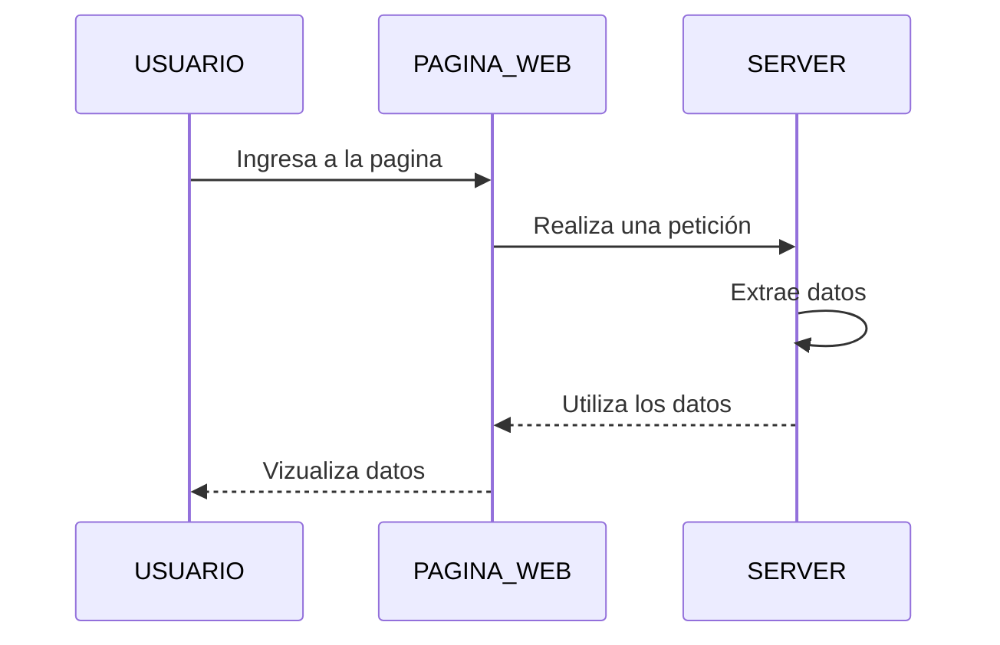
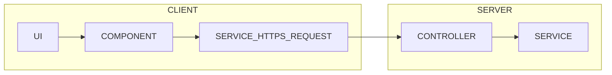

# Asistenciapp

##

## Admin/User

```mermaid
sequenceDiagram
USUARIO->>PAGINA_WEB: Ingresa a la pagina
PAGINA_WEB->>SERVER: Realiza una petición
SERVER->>SERVER: Extrae datos
SERVER-->>PAGINA_WEB:Utiliza los datos
PAGINA_WEB-->>USUARIO:Vizualiza datos
```
##

## ARQUITECTURA DE SOFTWARE POR CAPAS

```mermaid
flowchart LR
    subgraph CLIENT
    UI-->COMPONENT
    end
    subgraph CLIENT
    COMPONENT-->SERVICE_HTTPS_REQUEST
    end
    subgraph SERVER
    CONTROLLER-->SERVICE
    end
    SERVICE_HTTPS_REQUEST-->CONTROLLER
```
